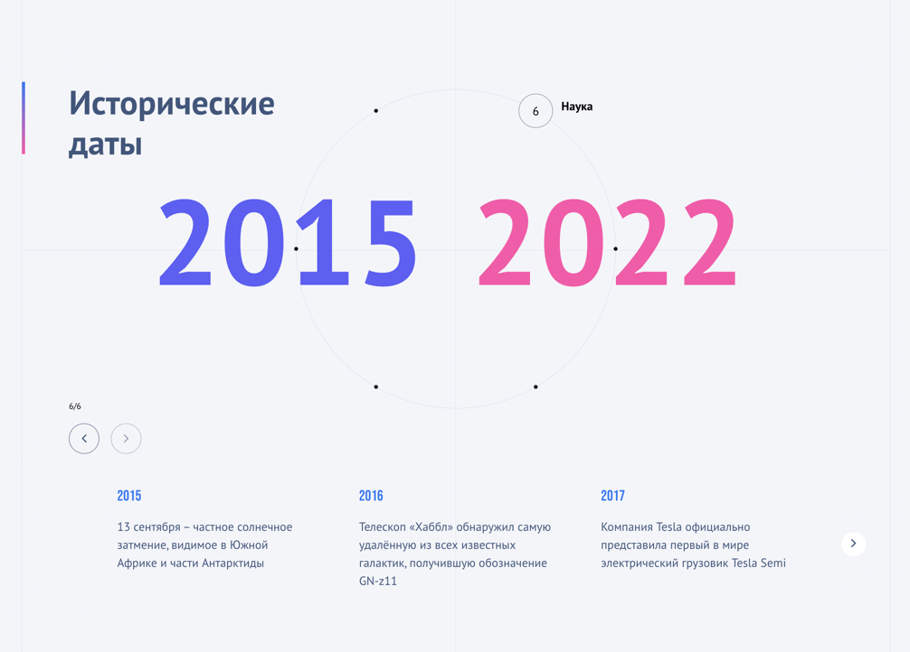

# Круглая карусель с выбором диапазона дат

#### Стек - React, SCSS, Prettier, GSap, TypeScript, Swiper.

## Запуск

Для запуска проекта локально необходимо:
### `git clone url`

### а затем

### `yarn start`

Запускается на [http://localhost:3000](http://localhost:3000) в браузере.

## Демонстрация интерфейса

